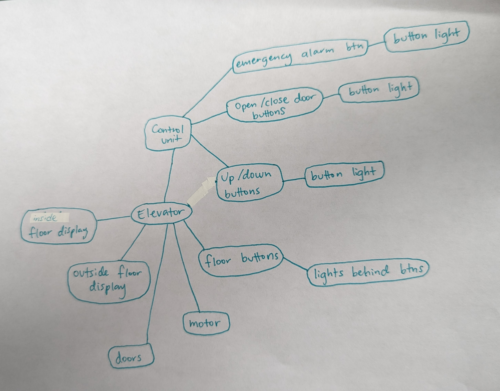

# How does an elevator work?

.jpg)

## Functionality 

### Simple user experience:

 - I press the button to go up or down 
 - I enter the cab (the elevator room)
 - I push the floor I want to go to
 - I exit the elevator

 ### **User Story**:
 <u>As a user</u> <u>I want to</u> *be transported to a different floor* <u>so that I</u> *can continue to my desired location.*

 

 ## Objects

 - control unit
    - emergency alarm button
        - button light
    - open/close buttons
        - button light
    - up/down buttons
        - button light
    - floor buttons
        - button lights
- cab floor display
- outside floor display
- door
- motor

## Pseudocode

PROGRAM ElevatorSystem
- DECLARE Elevator
- START 
    - DECLARE ControlUnit
    - DECLARE Door
    - DECLARE Motor
    - DECLARE CabFloorDisplay
    - DECLARE OutsideFloorDisplay
    - DECLARE Buttons[]

    - FUNCTION ElevatorInitialization()
        - INIT ControlUnit = new ControlUnit()
        - INIT EmergencyAlarmLight = new EmergencyAlarmLight()
        - INIT Door = new Door()
        - INIT Motor = new Motor()
        - INIT CabFloorDisplay = new CabFloorDisplay()
        - INIT OutsideFloorDisplay = new OutsideFloorDisplay()
        - INIT Buttons = new Array(FloorsCount)
        - FOR floor FROM 1 to FloorsCount
            - INIT Buttons[floor] = new Button(floor)
        - ENDFOR
    - ENDFUNCTION

    - FUNCTION PressFloorButton(floor)
        - Buttons[floor].press()
    - ENDFUNCTION

    - FUNCTION OpenDoor()
        - CALL Door.open()
    - ENDFUNCTION

    - FUNCTION CloseDoor()
        - CALL Door.close()
    - ENDFUNCTION

    - FUNCTION MoveElevatorTo(floor)
        - CALL Motor.move(floor)
        - DEC CabFloorDisplay = floor
        - DEC OutsideFloorDisplay = floor
    - ENDFUNCTION

    - FUNCTION ElevatorEmergency()
        - CALL EmergencyAlarmLight.activate()
        - CALL Motor.stop()
    - ENDFUNCTION
- END

- DECLARE Button
    - START
        - DECLARE Floor
        - DECLARE LightStatus

        - FUNCTION ButtonInitialization(floor)
            - DEC Floor = floor
            - DEC LightStatus = OFF
        - ENDFUNCTION

        - FUNCTION press()
            - DEC LightStatus = ON
        - ENDFUNCTION
    - END
- ENDPROGRAM

